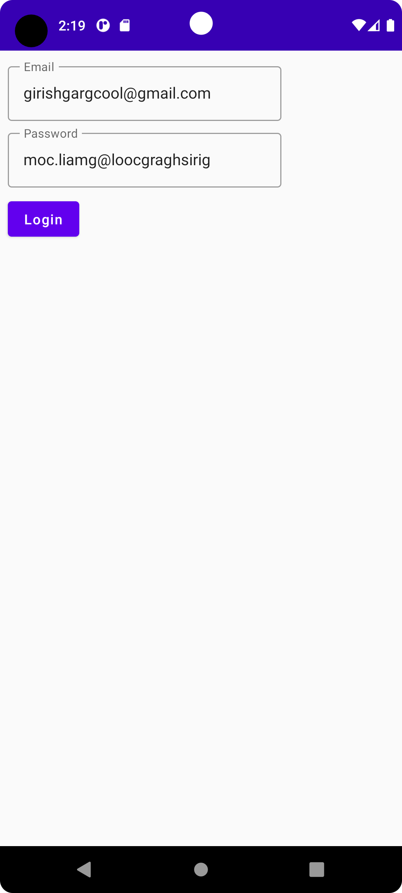
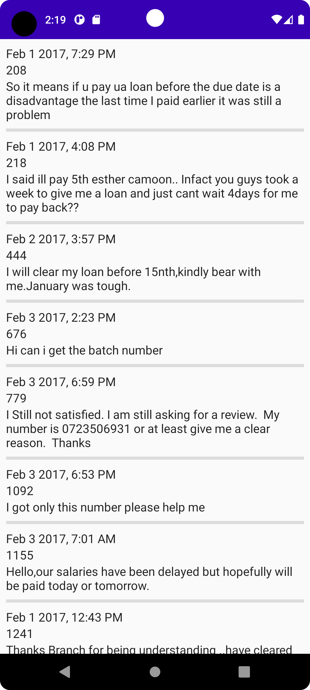
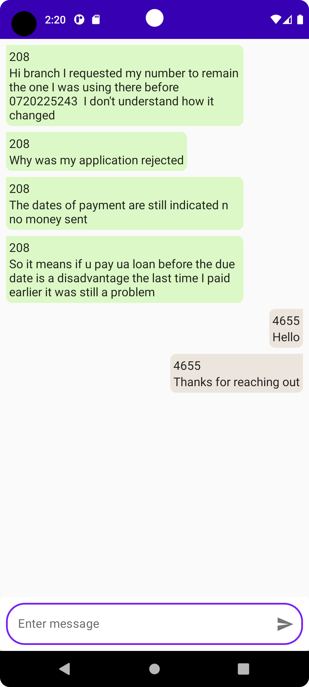

# Branch International Assignment
Mobile version of the web based app that could be used to respond to customer inquiries while on the go.

# 📷 Previews

<p align="center">
  
  
  
</p>

# 🛠 Tech Sacks & Open Source Libraries
- Jetpack Compose
- ViewModel
- Hilt
- Compose Navigation
- DataStore
- Retrofit 
- moshi

# File structure
<details>
    <summary>Click me</summary>

  ```
  branch_project
    │   BranchApplication.kt
    │   MainActivity.kt
    │
    ├───data
    │   ├───local
    │   ├───mapper
    │   │       MessageMapper.kt
    │   │
    │   ├───remote
    │   │       BranchApi.kt
    │   │       LoginRequest.kt
    │   │       LoginResponse.kt
    │   │       MessageDto.kt
    │   │       MessageRequest.kt
    │   │
    │   └───repository
    │           BranchRepositoryImpl.kt
    │
    ├───di
    │       AppModule.kt
    │       RepositoryModule.kt
    │
    ├───domain
    │   ├───model
    │   │       Message.kt
    │   │
    │   └───repository
    │           BranchRepository.kt
    │
    ├───presentation
    │   ├───chat
    │   │       ChatScreen.kt
    │   │       ChatState.kt
    │   │       ChatViewModel.kt
    │   │       MessageItem.kt
    │   │
    │   ├───home
    │   │       HomeScreen.kt
    │   │       HomeState.kt
    │   │       HomeViewModel.kt
    │   │       ThreadItem.kt
    │   │
    │   ├───login
    │   │       LoginScreen.kt
    │   │       LoginState.kt
    │   │       LoginViewModel.kt
    │   │
    │   └───navigation
    │           HomeNavGraph.kt
    │           RootNavGraph.kt
    │           Screen.kt
    │
    ├───ui
    │   └───theme
    │           Color.kt
    │           Shape.kt
    │           Theme.kt
    │           Type.kt
    │
    └───util
            AgentPreferences.kt
            Resource.kt
  ```
</details>
